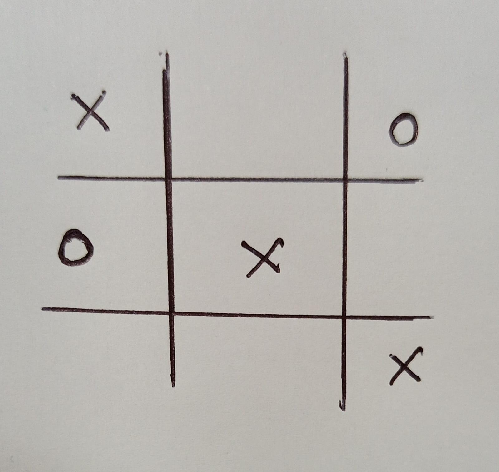
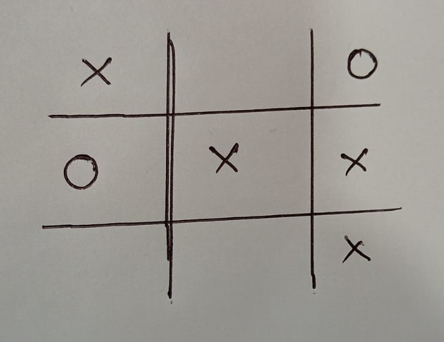
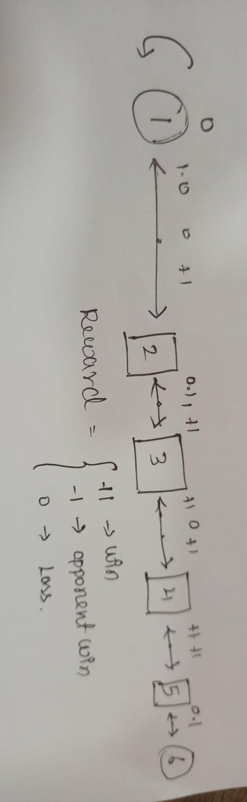
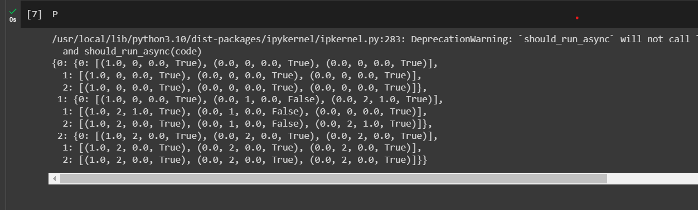

# MDP REPRESENTATION

## AIM:
To represent any one real-world problem AI agent that learns to play the Tic-Tac-Toe (XO) game in MDP form.

## PROBLEM STATEMENT:
To solve the Tick-Tack-Toe game

## Problem Description
The problem is to develop an AI agent that learns to play the Tic-Tac-Toe (XO) game optimally using Reinforcement Learning. The agent should learn a policy that allows it to make the best moves in order to win or achieve a draw against an opponent.

## State Space
The state space represents all possible configurations of the Tic-Tac-Toe board. Each cell can be empty, filled with an X, or filled with an O. As there are 9 cells in a 3x3 grid, there are 3 to the power 9 = 19683 possible states.

## Sample State

In this sample state, the Tic-Tac-Toe board is shown with Xs and Os placed in certain cells. Each cell can be empty, have an X, or have an O. The state captures the current configuration of the game board, which is a critical aspect of the game's dynamics.

## Action Space
The action space consists of all the possible actions that the agent can take in a given state. In Tic-Tac-Toe, an action corresponds to placing an X or an O in an empty cell on the board.

## Sample Action

In simpler terms, imagine the Tic-Tac-Toe game board with Xs and Os placed in certain spots. When it's the AI's turn, it decides to put its X in the bottom-right corner because it thinks it's the best move. This action changes the game board, and now there's an X in that corner. This action shows how the AI plays the game by picking where to place its X based on what's already on the board. This process keeps going until the game is won or ends in a tie, and the AI learns from each action to get better at playing.

## Reward Function
The reward function provides immediate feedback to the agent based on the action it takes. The rewards can be defined as follows:

+1 if the agent wins the game.
-1 if the opponent wins the game.
0 for any other state that doesn't lead to an immediate win or loss.

## Graphical Representation

## PYTHON REPRESENTATION:
~~~
Developed By: Kiran J
Ref No: 212221240022
~~~
~~~python
pip install git+https://github.com/mimoralea/gym-walk#egg=gym-walk
import gym
import gym_walk

P={
    0: {
        0: [(1.0, 0, 0.0, True), (0.0, 0, 0.0, True), (0.0, 0, 0.0, True)],
        1: [(1.0, 0, 0.0, True), (0.0, 0, 0.0, True), (0.0, 0, 0.0, True)],
        2: [(1.0, 0, 0.0, True), (0.0, 0, 0.0, True), (0.0, 0, 0.0, True)]
    },
    1: {
        0: [(1.0, 0, 0.0, True), (0.0, 1, 0.0, False), (0.0, 2, 1.0, True)],
        1: [(1.0, 2, 1.0, True), (0.0, 1, 0.0, False), (0.0, 0, 0.0, True)],
        2: [(1.0, 2, 0.0, True), (0.0, 1, 0.0, False), (0.0, 2, 1.0, True)]
    },
    2: {
        0: [(1.0, 2, 0.0, True), (0.0, 2, 0.0, True), (0.0, 2, 0.0, True)],
        1: [(1.0, 2, 0.0, True), (0.0, 2, 0.0, True), (0.0, 2, 0.0, True)],
        2: [(1.0, 2, 0.0, True), (0.0, 2, 0.0, True), (0.0, 2, 0.0, True)]
    }
}

P
~~~

## OUTPUT:

## RESULT:
Thus, the MDP is used to create a AI to play Tick-Tack-Toe game has successfullu created.
